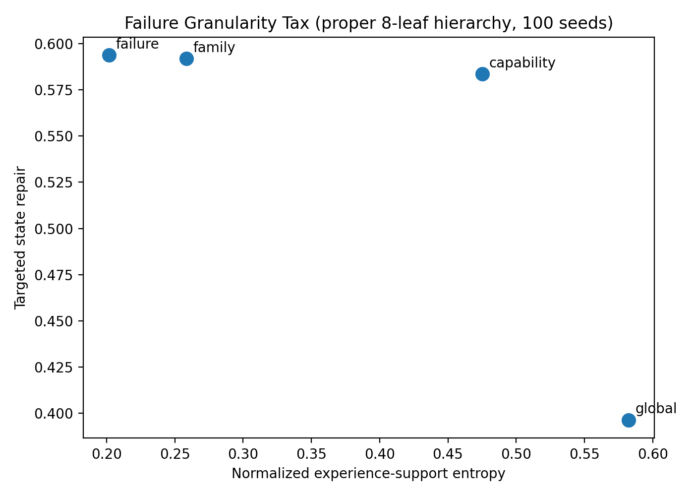
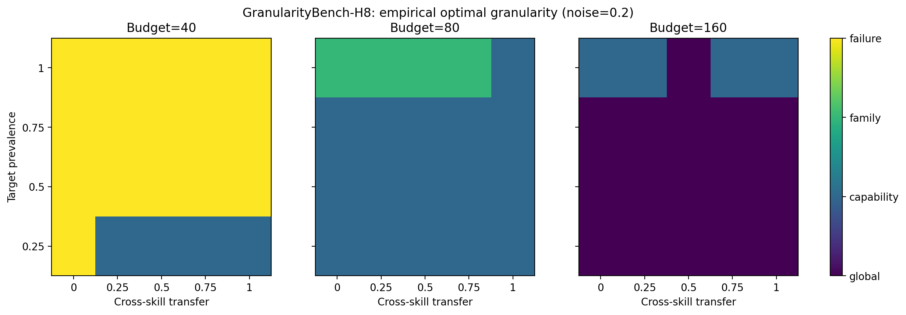
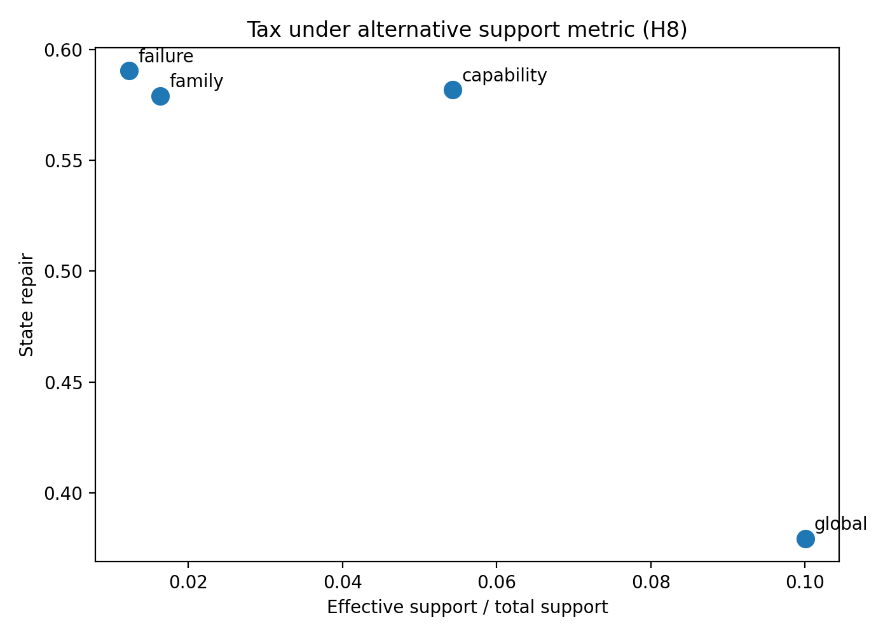

# The Failure Granularity Tax: How Detailed Should Agent Failures Be for Self-Evolving Training?

**Anonymous Authors**

## Abstract

Self-evolving agents increasingly use observed failures to decide what experience to generate next. A natural assumption is that more precise failure diagnosis should yield better training curricula. We test this assumption in a controlled setting and find that it is incomplete. We introduce **failure granularity** as an independent curriculum variable and build **GranularityBench-H8**, a CPU-executable procedural benchmark with a strict four-level hierarchy: Global → Capability → Failure Family → Individual Failure over eight agent failure mechanisms. This hierarchy allows diagnostic specificity, cross-skill transfer, task entanglement, diagnostic noise, horizon, stochastic transition noise, training budget, and deployment concentration to be manipulated independently.

Across **5,840 seeded training configurations**, a 100-seed causal intervention reveals a sharp local–global trade-off. Conditioning directly on an individual failure raises targeted state-tracking repair by **0.197** relative to global training (95% bootstrap CI [0.182, 0.212]) and raises target-only success by **9.66 percentage points**, but normalized experience-support entropy falls by **0.380**, broad held-out success falls by **23.32 points**, and external-shift success falls by **23.53 points**. The result survives alternative support definitions including effective support, coverage, and Jensen–Shannon divergence. An empirical phase diagram over transfer, target prevalence, diagnostic noise, and budget shows systematic regime changes: at diagnostic noise 0.2, fine failure conditioning wins 16/20 transfer–prevalence cells at budget 40, capability-level conditioning wins 16/20 at budget 80, and global training wins 16/20 at budget 160. Under heterogeneous evaluation distributions, however, fixed failure-conditioning strategies do not outperform a strong difficulty curriculum.

We formalize this phenomenon as the **Failure Granularity Tax**: finer diagnoses increase repair alignment while shrinking the support of future experience. A discrete single-crossing result characterizes when an intermediate abstraction is optimal. Our results argue that failure diagnosis and curriculum specialization should be treated as distinct design choices: knowing *why* an agent failed does not imply that future experience should collapse to that failure.

---

## 1. Introduction

Modern agents learn in environments that are increasingly generated, simulated, or adapted online. Synthetic task generation can supply executable experiences at scale; adaptive schedulers can emphasize policy-boundary or high-learning-value examples; and self-evolving arenas can use observed capability gaps to synthesize the next round of training tasks. These developments shift a central design problem from *whether* to adapt experience toward *how* to condition that adaptation.

Consider an agent that retrieves the correct customer identifier and later uses a stale identifier. The same trajectory can be summarized at several abstraction levels:

1. **Global:** the agent failed;
2. **Capability:** the failure belongs to interaction execution;
3. **Family:** the failure is temporal/state-dependent;
4. **Failure:** the specific mechanism is state tracking.

The finest diagnosis is informationally richest. It is therefore tempting to generate the next training tasks specifically around state tracking. But this changes two quantities simultaneously. It increases **repair alignment**—the training distribution is better matched to the diagnosed weakness—while reducing **experience support**—the agent sees fewer neighboring mechanisms, task compositions, and cross-skill contexts. The second effect can reduce transfer even when local repair improves.

We call this tension the **Failure Granularity Tax**. The tax is not the claim that fine conditioning is always bad. Rather, it is the opportunity cost paid when diagnostic specificity collapses the support of future experience. The optimal abstraction should therefore depend on the deployment distribution, transfer structure, available budget, and reliability of the diagnosis.

Existing work motivates but does not isolate this question. Curriculum learning studies ordering and selection of training examples; automatic curriculum methods select tasks based on progress or difficulty; procedural RL methods prioritize levels or generate environments; and recent agent work synthesizes tool environments, adapts task difficulty, or schedules data around model capabilities. Our focus is orthogonal: **holding the underlying agent-learning problem fixed, at what abstraction level should a diagnosed failure control future experience?**

### 1.1 Contributions

We make five contributions:

1. **Failure granularity as a curriculum variable.** We separate the information contained in a diagnosis from the specificity of the training distribution induced by that diagnosis.
2. **GranularityBench-H8.** We introduce a fully procedural eight-failure benchmark with a strict nested hierarchy and independent controls for transfer, entanglement, diagnostic noise, transition stochasticity, horizon, budget, and deployment concentration.
3. **Causal evidence for a repair–support trade-off.** In a 100-seed intervention, finer conditioning produces substantially stronger target repair but sharply lower experience support and broad transfer.
4. **An empirical granularity phase diagram.** A 4,320-configuration sweep demonstrates systematic shifts from fine to intermediate to global conditioning as training budget increases, with target prevalence, transfer, and noise modulating the boundary.
5. **A principled theory and negative results.** We give a single-crossing characterization of optimal granularity, show robustness to alternative support metrics and additional stressors, and report that fixed failure-conditioned curricula do not beat difficulty scheduling under broad heterogeneous evaluation.

The goal is not to claim a new frontier language model. GranularityBench-H8 deliberately removes language-model scale as a confound so that the causal role of diagnostic abstraction can be measured exhaustively and reproducibly on CPU.

---

## 2. Related Work

### 2.1 Curriculum learning and automatic task selection

Curriculum learning organizes examples or tasks to improve optimization and generalization (Bengio et al., 2009). Teacher–Student Curriculum Learning selects subtasks according to learning progress (Matiisen et al., 2017), while reverse curriculum generation grows start-state difficulty around achievable regions (Florensa et al., 2017). Prioritized Level Replay selects procedurally generated levels using estimated learning potential (Jiang et al., 2020). These approaches establish that the training distribution should depend on the learner. Our question is narrower: how much of a failure diagnosis should be used to narrow that distribution?

### 2.2 Environment design and procedural generalization

Unsupervised environment design, including PAIRED, treats the environment distribution itself as an adaptive optimization object and uses regret to generate solvable but challenging environments (Dennis et al., 2020). This literature highlights the importance of the relationship between training support and zero-shot transfer. Failure granularity introduces a complementary axis: the abstraction level of the diagnostic signal conditioning environment selection.

### 2.3 Synthetic environments and self-evolving agents

Recent agent systems increasingly create their own training experience. Agent-World combines scalable executable environment/task discovery with continuous training around detected capability gaps. AutoPlay explores interactive environments to synthesize feasible and verifiable tasks. SYNTHAGENT jointly synthesizes tool-use tasks, mock environments, simulated users, and rubric-based rewards, while SynthAgent refines synthetic web tasks and trajectories. AgenticQwen uses multi-round synthetic-data flywheels that increase reasoning and agentic task complexity. These systems demonstrate the practical importance of adaptive synthetic experience. They do not, however, isolate whether a failure should condition future experience globally, at a broad capability level, at a failure-family level, or at a specific mechanism level.

### 2.4 Adaptive data scheduling for RL

Adaptive Data Scheduling (ADS) replaces uniform RL sampling with adaptive semantic-cluster scheduling and policy-boundary selection. Such work asks *which data are informative now*. Failure granularity instead asks *at which diagnostic abstraction should the candidate data distribution be defined*. The two questions are complementary: a policy-boundary selector could operate inside any granularity level.

---

## 3. Problem Formulation

Let the set of failure mechanisms be

\[
\mathcal F=\{f_1,\ldots,f_K\}.
\]

A failure hierarchy consists of nested partitions

\[
\Pi_0 \preceq \Pi_1 \preceq \cdots \preceq \Pi_G,
\]

where each successive partition refines the previous one. For a diagnosed failure \(f\), let \(B_g(f)\) denote the block containing \(f\) at granularity \(g\). A curriculum generator conditioned at level \(g\) samples

\[
x\sim q_g(x\mid B_g(f)).
\]

Finer granularity makes \(B_g(f)\) smaller. This can increase the probability that a sampled experience exercises the deficient mechanism, but it can also reduce the diversity of neighboring skills and compositions.

We decompose curriculum utility as

\[
J_g = A_g - \lambda C_g,
\]

where \(A_g\) is repair alignment and \(C_g\) is a support-mismatch cost relative to the downstream distribution. \(\lambda\) captures how strongly broad transfer matters for the deployment objective.

### 3.1 Repair alignment

For target failure \(f\), define

\[
A_g(f)=\mathbb E[\Delta c_f\mid q_g],
\]

where \(c_f\) is competence on the target failure mechanism.

### 3.2 Experience support

We measure support in four ways:

- normalized entropy \(H(q_g)/\log |\mathcal X|\);
- normalized effective support \(\exp(H(q_g))/|\mathcal X|\);
- empirical support coverage;
- Jensen–Shannon divergence from the global training distribution.

The main experiments use normalized entropy; the remaining definitions are robustness checks.

### 3.3 Granularity regret

For a regime \(r\), let \(g_r^*\) be the best fixed granularity. The regret of a selected level \(\hat g\) is

\[
\mathrm{Regret}(\hat g;r)=R(g_r^*;r)-R(\hat g;r).
\]

This metric becomes useful when differences between fixed strategies are small: it measures whether a controller correctly identifies the regime-specific abstraction.

---

## 4. Theory: Why an Interior Granularity Can Be Optimal

### Proposition 1 — Support contraction under nested conditioning

Let \(S_g\) be the support of the experience generator at granularity \(g\), and assume

\[
S_{g+1}\subseteq S_g.
\]

Then the maximum possible entropy obeys

\[
H(q_{g+1})\le \log|S_{g+1}|\le \log|S_g|.
\]

Thus, finer conditioning weakly decreases the maximum attainable experience support. If refinement removes at least one experience with positive probability and the generator assigns nonzero mass across the coarser support, the inequality is strict.

This proposition is structural: it does not require a particular learning algorithm. It establishes that diagnostic refinement can impose a support cost even when the diagnosis itself is perfectly correct.

### Proposition 2 — Single-crossing optimal granularity

Order granularities from coarse to fine. Define adjacent increments

\[
a_g=A_{g+1}-A_g,\qquad c_g=C_{g+1}-C_g>0,
\]

and marginal alignment-to-cost ratios

\[
r_g=\frac{a_g}{c_g}.
\]

Assume \(r_g\) is strictly decreasing with \(g\). Then \(J_g=A_g-\lambda C_g\) is unimodal. Moreover, the unique optimum is level \(k\) whenever

\[
r_k < \lambda < r_{k-1},
\]

with boundary conventions \(r_{-1}=+\infty\) and \(r_G=-\infty\).

**Proof sketch.** Adjacent utility differences satisfy

\[
J_{g+1}-J_g=a_g-\lambda c_g=c_g(r_g-\lambda).
\]

Because \(c_g>0\), the sign is determined by \(r_g-\lambda\). Strictly decreasing \(r_g\) implies the sign can switch from positive to negative at most once, yielding a unique interior maximizer when \(\lambda\) falls between adjacent ratios. A full proof is in Appendix A.

### Corollary — Deployment concentration

If increasing target-failure prevalence reduces the effective weight on broad-support mismatch, i.e. \(\lambda(\rho)\) decreases with target prevalence \(\rho\), Proposition 2 predicts a weak shift toward finer optimal granularities as the deployment distribution concentrates around the target mechanism.

### Budget interpretation

Fine curricula can have high early learning rates because a large fraction of experiences exercise the target. Broad curricula accumulate competence across more mechanisms and can catch up as budget increases. Consequently, even with fixed deployment concentration, the effective alignment-to-cost trade-off can change with budget. We test this empirically rather than asserting monotonicity as a theorem.

---

## 5. GranularityBench-H8

GranularityBench-H8 is a procedural skill-acquisition environment designed to isolate failure-conditioning granularity. It contains eight latent mechanisms:

1. tool selection;
2. argument grounding;
3. action ordering;
4. state tracking;
5. premature termination;
6. recovery;
7. constraint compliance;
8. verification.

### 5.1 Strict hierarchy

The final benchmark uses a genuine nested hierarchy:

- **Global:** all eight mechanisms;
- **Capability:** four mechanisms per capability;
- **Family:** two mechanisms per failure family;
- **Failure:** one mechanism.

For the state-tracking target used in the direct causal study:

\[
\{1,\ldots,8\}
\supset
\{\text{tool,arg,order,state}\}
\supset
\{\text{order,state}\}
\supset
\{\text{state}\}.
\]

This nesting is important: each level has strictly different candidate support.

### 5.2 Task generation

Each task contains a binary requirement vector \(z\in\{0,1\}^8\), difficulty \(d\), and horizon \(h\). A global task samples requirements broadly. Capability-, family-, and failure-conditioned tasks progressively restrict the mechanism set. Entanglement can introduce additional requirements, while transition noise can add an unobserved secondary requirement.

### 5.3 Agent competence and success

Agents maintain mechanism-level competence \(c\in[0,1]^8\). For a task requiring mechanisms \(z\), success probability is a logistic function of required competence, task difficulty, horizon, and—where applicable—shared representation:

\[
p(\mathrm{success}\mid x)=\sigma\!\left(\beta\left[\frac{c^\top z}{\|z\|_1}-d+s(z)\right]-\eta(h-4)_+\right).
\]

Updates are strongest near the learning frontier through a factor proportional to \(p(1-p)\). This creates diminishing value for examples that are either already solved or far beyond the current policy.

### 5.4 Three representation/update regimes

We evaluate:

- **Tabular/no-transfer:** only directly exercised skills are updated;
- **Linear-sharing:** moderate structured cross-skill transfer;
- **Nonlinear-sharing:** stronger state-dependent transfer with diminishing cross-skill gains.

These are controlled learning regimes, not claims about language-model architectures.

---

## 6. Curricula

We compare six curricula under identical training budgets.

**Uniform.** Broad random task sampling.

**Difficulty.** From a small candidate set, select the task whose predicted success is closest to 0.5.

**Capability.** Diagnose failure mass and sample from the corresponding four-mechanism capability.

**Family.** Diagnose failure mass and sample from the corresponding two-mechanism family.

**Failure.** Sample individual failure-conditioned tasks according to the diagnosed failure distribution.

**Random Granularity.** Randomly choose among global, capability, family, and failure conditioning.

Diagnostic noise routes an observed failure to an incorrect mechanism with controlled probability.

---

## 7. Experimental Protocol

### 7.1 Main heterogeneous-distribution experiment

We use 20 untouched seeds per representation regime, three regimes, six curricula, three training rounds, and four evaluation checkpoints. This produces 360 complete training runs and 1,440 checkpoint evaluations.

### 7.2 Direct causal granularity intervention

The central experiment uses 100 untouched seeds. The target is state tracking. Each agent receives exactly 100 training experiences at one fixed granularity. We then evaluate:

- state-repair gain;
- target-only success;
- broad held-out success;
- external-shift success;
- support entropy;
- support coverage;
- mean all-skill gain.

### 7.3 Empirical phase diagram

We sweep:

\[
\text{transfer}\in\{0,.25,.5,.75,1\},
\]

\[
\text{target prevalence}\in\{.25,.5,.75,1\},
\]

\[
\text{budget}\in\{40,80,160\},
\]

\[
\text{diagnostic noise}\in\{0,.2,.4\}.
\]

With six independent seeds and four granularities, this contributes 4,320 seeded training configurations.

### 7.4 Robustness and stress tests

We additionally test:

- alternative support definitions on 40 seeds;
- entanglement from 0 to 1;
- horizon from 2 to 16;
- stochastic transition noise from 0 to 0.4;
- 100-seed direct replication with paired bootstrap and Wilcoxon tests.

The full final suite contains **5,840 seeded training configurations** excluding plotting and analysis-only computations.

### 7.5 Statistics

Primary causal comparisons use paired differences over seeds, 10,000-sample bootstrap confidence intervals, paired t-tests, and Wilcoxon signed-rank tests as a nonparametric robustness check. Main multi-method comparisons receive Holm correction. We report effect sizes and confidence intervals rather than relying on significance alone.

---

## 8. Results

### 8.1 Under a broad heterogeneous distribution, fixed granularity is not a strong winner

| Method | Held-out | External shift |
|---|---:|---:|
| Difficulty | **87.89%** | **84.01%** |
| Random granularity | 87.83% | 83.96% |
| Capability | 87.81% | 83.96% |
| Uniform | 87.81% | 83.92% |
| Family | 87.76% | 83.87% |
| Failure | 87.74% | 83.86% |

The differences are small. After Holm correction, no pairwise comparison establishes a robust advantage of failure-conditioned training over the difficulty baseline. This null result matters: failure information alone does not imply broad-distribution gains.

### 8.2 Fine conditioning strongly improves local repair but collapses broad support




The 100-seed intervention gives the central result.

| Granularity | Support entropy | Coverage | State repair | Target-only success | Broad held-out | External |
|---|---:|---:|---:|---:|---:|---:|
| Global | **0.582** | **0.133** | 0.396 | 72.30% | **72.47%** | **67.46%** |
| Capability | 0.475 | 0.075 | 0.583 | **83.47%** | 63.51% | 58.93% |
| Family | 0.258 | 0.038 | 0.592 | 81.97% | 50.38% | 45.61% |
| Failure | **0.202** | **0.035** | **0.594** | 81.97% | 49.15% | 43.93% |

Relative to Global, individual Failure conditioning changes:

\[
\Delta \mathrm{StateRepair}=+0.197
\]

with 95% bootstrap CI [0.182, 0.212], while

\[
\Delta \mathrm{SupportEntropy}=-0.380
\]

(CI [-0.386, -0.374]),

\[
\Delta \mathrm{Heldout}=-23.32\ \mathrm{pp}
\]

(CI [-23.97, -22.67]), and

\[
\Delta \mathrm{External}=-23.53\ \mathrm{pp}
\]

(CI [-24.19, -22.86]). All paired tests are highly significant.

Importantly, the finest curriculum is **not** best even on target-only success: Capability reaches 83.47%, about 1.5 points above Family and Failure. This is a concrete intermediate-granularity effect. Fine conditioning attains the highest direct state-repair coefficient, but neighboring skills remain useful even when deployment is entirely state-focused.

### 8.3 The tax is not an artifact of entropy

We repeat the support analysis with effective support, raw coverage, and Jensen–Shannon divergence from Global. Mean effective support falls from 0.100 under Global to 0.054 under Capability, 0.016 under Family, and 0.012 under Failure. Across seed-level observations, effective support correlates strongly with broad evaluation performance (Spearman \(\rho=0.833\), \(p<10^{-41}\)); Jensen–Shannon divergence correlates negatively (\(\rho=-0.807\), \(p<10^{-37}\)). Meanwhile, support entropy correlates negatively with state repair (\(\rho=-0.584\)), exactly reflecting the local-repair/broad-support trade-off.

### 8.4 A granularity phase transition appears as budget changes




The empirical phase diagram is the strongest regime-level result. At diagnostic noise 0.2:

- **Budget 40:** Failure wins 16/20 transfer × prevalence cells; Capability wins 4/20.
- **Budget 80:** Capability wins 16/20; Family wins 4/20.
- **Budget 160:** Global wins 16/20; Capability wins 4/20.

The qualitative transition is also visible at diagnostic noise 0 and 0.4. At zero noise, Failure wins 80% of low-budget cells, Capability wins 65% of medium-budget cells, and Global wins 100% of high-budget cells. At noise 0.4, Failure wins 80% at low budget, Capability 70% at medium budget, and Global 80% at high budget.

Thus, no single abstraction is universally optimal. Fine conditioning is most valuable when training opportunities are scarce; broader conditioning dominates once sufficient budget allows the agent to benefit from neighboring skills and support coverage.

### 8.5 Target prevalence moves the boundary

Within a fixed budget, increased target prevalence generally makes narrower curricula more competitive. For example, at noise 0.2 and budget 80, Capability wins most cells at 25–75% target prevalence, while Family wins four of the five transfer settings at 100% prevalence. At budget 160, Global dominates low-to-moderate target prevalence while Capability becomes competitive at fully concentrated deployment.

This pattern is consistent with the single-crossing interpretation: as the downstream objective concentrates on one region of the failure hierarchy, the effective cost of reduced global support falls.

### 8.6 Entanglement, horizon, and stochasticity

Stress tests refine rather than overturn the main conclusion. At 50% target prevalence, Capability is usually the strongest intermediate level across horizons 2–16. Increasing entanglement eventually benefits broader training: at maximal entanglement, Global reaches 73.17% compared with Capability at 71.47%. Transition noise increases the value of broad support, although Capability remains strongest in the tested 50%-prevalence slice. Longer horizons lower absolute success but do not induce a clean granularity phase transition.

These mixed outcomes are reported as such; we do not claim that every nuisance variable monotonically shifts the optimum.

---

## 9. Discussion

### 9.1 Diagnosis and training specialization are different decisions

A detailed diagnosis can be useful for analysis without implying that the next training batch should be equally detailed. The direct experiment makes this distinction explicit. Individual failure conditioning repairs the diagnosed skill more strongly, but broad performance deteriorates because training support collapses.

This suggests a two-stage design for future self-evolving systems:

1. infer the most accurate failure representation available;
2. independently choose the granularity at which that information should shape training.

Conflating the two steps implicitly assumes that maximal diagnostic precision is also maximal curriculum precision. Our results show this assumption can fail dramatically.

### 9.2 Why Capability is often a strong compromise

Capability-level conditioning retains four related mechanisms in GranularityBench-H8. It therefore places substantial probability on the target while preserving enough neighboring structure to learn transferable competence. In the direct intervention it achieves the highest target-only success, even though Failure produces slightly higher raw target-mechanism repair. This distinction is important: deployment success depends on compositions of mechanisms, not merely the scalar competence of one leaf.

### 9.3 Why the optimum changes with budget

At low budget, broad sampling wastes scarce interactions on non-target mechanisms. Fine failure conditioning therefore wins most phase cells. At high budget, broad curricula eventually acquire both the target and complementary mechanisms while avoiding support collapse. The phase map makes this transition visible without requiring a new adaptive controller.

### 9.4 Implications for synthetic RL systems

Recent synthetic-agent pipelines often possess richer diagnostic signals than they use. The implication of this paper is not “ignore diagnosis,” but “do not equate diagnosis detail with data-distribution detail.” A practical system could estimate the transfer value of neighboring failures, maintain a support floor, or adapt abstraction as budget changes. Those extensions should be validated on real LLM agents before being treated as production prescriptions.

---

## 10. Limitations

The paper is intentionally controlled, and its claims are correspondingly bounded.

**No language model.** GranularityBench-H8 is not Qwen, Llama, Claude, GPT, or a natural-language tool-use benchmark. It abstracts away token generation, tool-schema parsing, prompt sensitivity, optimizer instability, and emergent representation learning.

**Designed hierarchy.** The eight-failure hierarchy is semantically motivated and the transfer structure favors stronger sharing within families/capabilities. The phase sweep varies transfer strength but does not exhaust arbitrary transfer graphs.

**Simplified learning dynamics.** Competence updates are interpretable proxies, not full policy-gradient optimization. Three update regimes provide robustness to sharing assumptions, but not architectural realism.

**Procedural evaluation.** The external shift changes diversity, horizon, and transition noise within the same simulator family. It is not an independent real-world benchmark.

**No universal monotonicity claim.** Diagnostic noise, horizon, and transition stochasticity do not each create a clean one-dimensional transition. The supported claim is the repair–support trade-off and regime dependence, not a universal rule for every axis.

These limitations make external LLM validation the clearest next step, but they do not invalidate the causal result within the controlled system.

---

## 11. Broader Impact

Adaptive synthetic training can reduce annotation cost and improve agent reliability, but overly narrow failure-driven curricula may create blind spots: the system may become excellent at a recently observed failure while losing breadth on less frequently sampled behaviors. The Failure Granularity Tax therefore has a safety-relevant interpretation: targeted repair should be accompanied by coverage monitoring. GranularityBench-H8 itself contains no personal data and uses no external services or proprietary models.

---

## 12. Conclusion

More precise failure diagnosis is not automatically better training supervision. In a strict eight-failure hierarchy, fine conditioning strongly improves local repair while shrinking experience support enough to damage broad and shifted performance. The best granularity changes systematically with training budget and deployment concentration: low-budget regimes favor fine targeting, intermediate regimes favor capability-level abstraction, and high-budget regimes favor broad training. We formalize this tension as the **Failure Granularity Tax**.

The central design principle is simple:

> **Diagnose failures as precisely as possible, but specialize training only as finely as the downstream transfer objective can afford.**

---

# Appendix

## Appendix A. Proofs

### A.1 Proof of Proposition 1

For any distribution \(q\) supported on a finite set \(S\), Shannon entropy satisfies \(H(q)\le \log |S|\), with equality iff \(q\) is uniform over \(S\). Under nested conditioning, \(S_{g+1}\subseteq S_g\), hence \(|S_{g+1}|\le |S_g|\) and therefore

\[
H(q_{g+1})\le \log|S_{g+1}|\le \log|S_g|.
\]

If refinement removes at least one support element and the coarser generator can assign positive mass to it, the maximum attainable entropy strictly decreases.

### A.2 Proof of Proposition 2

Let

\[
J_g=A_g-\lambda C_g.
\]

Then

\[
J_{g+1}-J_g=(A_{g+1}-A_g)-\lambda(C_{g+1}-C_g)=a_g-\lambda c_g.
\]

Because \(c_g>0\),

\[
\operatorname{sign}(J_{g+1}-J_g)=\operatorname{sign}(r_g-\lambda),
\]

where \(r_g=a_g/c_g\). If \(r_g\) is strictly decreasing, the sequence \(r_g-\lambda\) can cross zero at most once. Therefore the utility sequence first increases and then decreases, or is monotone at a boundary. If

\[
r_k<\lambda<r_{k-1},
\]

then increments are positive up through \(k-1\) and negative from \(k\) onward, so \(k\) is the unique maximizer. □

### A.3 Corollary on target prevalence

Suppose the downstream objective is

\[
R_\rho=\rho R_{target}+(1-\rho)R_{broad},
\]

and increasing \(\rho\) decreases the effective support penalty \(\lambda(\rho)\). The threshold rule in Proposition 2 then implies that crossing to smaller \(\lambda\) values weakly shifts the optimum toward levels with larger \(g\), i.e. finer conditioning.

### A.4 What the theorem does and does not assert

The theorem does **not** assert that empirical alignment must rise monotonically at every adjacent level. In fact, target-only success peaks at Capability in our main intervention. The theorem provides sufficient conditions for an interior optimum and a language for interpreting the observed phase transitions. The empirical result is stronger than a schematic monotonic story precisely because neighboring-skill transfer can make an intermediate abstraction outperform the finest one even on target-concentrated evaluation.

---

## Appendix B. Failure Hierarchy

| Level | Target-state block | Cardinality |
|---|---|---:|
| Global | all eight failures | 8 |
| Capability | tool, argument, ordering, state | 4 |
| Family | ordering, state | 2 |
| Failure | state | 1 |

The second capability contains termination, recovery, constraint, and verification. Families are {tool, argument}, {ordering, state}, {termination, recovery}, and {constraint, verification}.

---

## Appendix C. Procedural Generator

Each generated task contains:

- a non-empty requirement mask over eight mechanisms;
- difficulty sampled from a bounded beta-derived distribution;
- Poisson-distributed horizon;
- optional entangled requirements;
- optional stochastic transition requirement.

Global generation samples broadly across all failures. Capability generation samples inside one four-leaf block, Family inside one two-leaf block, and Failure around one leaf with optional entanglement.

---

## Appendix D. Learning Regimes

**Tabular.** Directly required mechanisms update; no cross-skill transfer.

**Linear-sharing.** Required mechanisms update directly and produce moderate transfer proportional to hierarchical affinity.

**Nonlinear-sharing.** Transfer is stronger when the receiving skill remains weak, yielding diminishing cross-skill gains.

The hierarchy affinity is highest within a family, lower within a capability, and lowest across capabilities. Transfer strength is multiplied by the experimental transfer coefficient.

---

## Appendix E. Curriculum Pseudocode

```text
Input: agent π, hierarchy H, method m, budget B
Diagnose failure distribution d from broad rollouts
for b = 1 ... B:
    if m = Uniform:
        x ← sample_global()
    if m = Difficulty:
        C ← sample_global_candidates(5)
        x ← argmin_x |Pπ(success|x) - 0.5|
    if m = Capability:
        c ← sample capability proportional to failure mass d
        x ← sample_from_capability(c)
    if m = Family:
        f ← sample family proportional to failure mass d
        x ← sample_from_family(f)
    if m = Failure:
        k ← sample individual failure proportional to d
        x ← sample_from_failure(k)
    if m = RandomGranularity:
        g ← Uniform{Global, Capability, Family, Failure}
        x ← sample_from_level(g)
    update π on x
```

---

## Appendix F. Experiment Inventory

| Component | Training configurations |
|---|---:|
| Main heterogeneous study | 360 |
| Direct causal intervention | 400 |
| Empirical phase diagram | 4,320 |
| Entanglement/horizon/stochasticity stress | 600 |
| Alternative support metrics | 160 |
| **Total** | **5,840** |

The main study additionally logs four checkpoints per run, producing 1,440 checkpoint evaluations.

---

## Appendix G. Full Direct-Intervention Statistics

Failure minus Global:

| Metric | Difference | 95% bootstrap CI | paired t p |
|---|---:|---:|---:|
| Support entropy | -0.380 | [-0.386, -0.374] | 1.08e-109 |
| State repair | +0.197 | [0.182, 0.212] | 5.08e-46 |
| Broad held-out | -23.32 pp | [-23.97, -22.67] | 1.62e-85 |
| External shift | -23.53 pp | [-24.19, -22.86] | 9.54e-85 |
| Target-only success | +9.66 pp | [8.42, 10.94] | 2.16e-27 |

Failure vs Family shows no meaningful state-repair gain (difference 0.0019; CI includes zero) but does reduce broad and external success. This is further evidence that maximal specificity can incur support cost without additional local repair.

---

## Appendix H. Alternative Support Metrics




| Level | Entropy | Effective support | Coverage | JS from Global | Broad eval |
|---|---:|---:|---:|---:|---:|
| Global | 0.584 | 0.100 | 0.134 | 0.000 | 72.23% |
| Capability | 0.474 | 0.054 | 0.073 | 0.524 | 68.19% |
| Family | 0.257 | 0.016 | 0.038 | 0.671 | 58.03% |
| Failure | 0.206 | 0.012 | 0.035 | 0.706 | 57.44% |

Seed-level Spearman correlations:

- effective support vs broad evaluation: \(\rho=0.833\);
- coverage vs broad evaluation: \(\rho=0.819\);
- JS divergence from Global vs broad evaluation: \(\rho=-0.807\);
- normalized entropy vs state repair: \(\rho=-0.584\).

All have \(p<10^{-13}\), and the broad-evaluation correlations are below \(10^{-37}\).

---

## Appendix I. Empirical Phase Diagram

At diagnostic noise 0.2, the fraction of transfer × prevalence cells won is:

| Budget | Global | Capability | Family | Failure |
|---:|---:|---:|---:|---:|
| 40 | 0.00 | 0.20 | 0.00 | **0.80** |
| 80 | 0.00 | **0.80** | 0.20 | 0.00 |
| 160 | **0.80** | 0.20 | 0.00 | 0.00 |

At zero noise the corresponding dominant fractions are Failure 0.80, Capability 0.65, and Global 1.00. At noise 0.4 they are Failure 0.80, Capability 0.70, and Global 0.80.

The phase diagram is descriptive rather than a universal law: some cells have small winner margins, particularly near boundaries.

---

## Appendix J. Stress Tests

Representative stress-test figures are included in `figures/fig_h8_entangle.png`, `figures/fig_h8_horizon.png`, and `figures/fig_h8_transition_noise.png`.


### J.1 Entanglement

At 50% target prevalence, Capability leads for entanglement 0–0.75. At maximal entanglement, Global becomes best (73.17%) versus Capability (71.47%), illustrating that highly compositional tasks can reward broader support.

### J.2 Horizon

Capability remains strongest across horizons 2, 4, 8, and 12. At horizon 16 all methods degrade; Capability remains ahead at 68.17%. Horizon therefore affects difficulty more reliably than optimal granularity in this slice.

### J.3 Transition noise

Capability remains strongest from transition noise 0 to 0.4, while Global closes much of the gap as stochasticity increases. We therefore retain this as a robustness result rather than claiming a stochasticity-driven phase transition.

---

## Appendix K. Main Multi-Method Statistical Result

The broad-distribution differences among curricula are small. In the Linear and Nonlinear regimes, uncorrected tests occasionally favor Difficulty over Failure or Uniform by roughly 0.1–0.17 percentage points, but no comparison survives the global Holm correction. The correct interpretation is a null method result under heterogeneous deployment, not a hidden positive claim for any failure abstraction.

---

## Appendix L. Power and Seed Policy

The direct causal effect is large and is replicated on 100 untouched seeds. For small curriculum differences in the main study, paired variability implies that detecting 0.25 percentage-point differences can require from roughly 7 to more than 50 seeds depending on the representation regime and comparison. We therefore avoid interpreting tiny uncorrected main-study differences as substantive.

Seed ranges are disjoint across experiment families. Phase diagrams, direct interventions, main study, and support robustness do not reuse their evaluation seeds.

---

## Appendix M. Negative Results

We explicitly retain the following negative findings:

1. Fine failure conditioning does not beat Difficulty under broad heterogeneous evaluation.
2. Family is not a universal sweet spot.
3. Diagnostic noise does not induce a simple monotonic coarse-graining rule across all budgets.
4. Horizon does not create a clean granularity transition in the tested range.
5. The finest level adds essentially no state-repair benefit over Family in the 100-seed intervention, while reducing broad transfer.

These negative results are central to the paper's thesis that granularity is regime-dependent.

---

## Appendix N. Reproducibility Checklist

- [x] CPU-only execution.
- [x] No external API key.
- [x] No pretrained model weights.
- [x] All random seeds recorded.
- [x] All raw CSVs retained.
- [x] Main tables generated from CSVs.
- [x] Confidence intervals generated programmatically.
- [x] Development and final H8 hierarchy code included.
- [x] Figures generated from raw results.
- [x] Negative results included.
- [x] Scope explicitly excludes LLM-SOTA claims.

---

## References

Bengio, Y., Louradour, J., Collobert, R., & Weston, J. (2009). Curriculum Learning. *ICML*.

Dennis, M., Jaques, N., Vinitsky, E., Bayen, A., Russell, S., Critch, A., & Levine, S. (2020). Emergent Complexity and Zero-shot Transfer via Unsupervised Environment Design. arXiv:2012.02096.

Dong, G., et al. (2026). Agent-World: Scaling Real-World Environment Synthesis for Evolving General Agent Intelligence. arXiv:2604.18292.

Florensa, C., Held, D., Wulfmeier, M., Zhang, M., & Abbeel, P. (2017). Reverse Curriculum Generation for Reinforcement Learning. arXiv:1707.05300.

Jiang, M., Grefenstette, E., & Rocktäschel, T. (2020). Prioritized Level Replay. arXiv:2010.03934.

Lyu, Y., Wang, C., Shen, L., Huang, J., & Xu, T. (2026). Mock Worlds, Real Skills: Building Small Agentic Language Models with Synthetic Tasks, Simulated Environments, and Rubric-Based Rewards. *ACL 2026*, 12529–12545.

Lyu, Y., Wang, C., Zheng, H., Yue, Y., Yan, J., Wang, M., & Huang, J. (2026). AgenticQwen: Training Small Agentic Language Models with Dual Data Flywheels for Industrial-Scale Tool Use. *ACL 2026 Industry Track*, 535–551.

Matiisen, T., Oliver, A., Cohen, T., & Schulman, J. (2017). Teacher-Student Curriculum Learning. arXiv:1707.00183.

Ramrakhya, R., Szot, A., Attia, O., Yang, Y., Nguyen, A., Mazoure, B., Gan, Z., Agrawal, H., & Toshev, A. (2026). Scaling Synthetic Task Generation for Agents via Exploration. *ICLR 2026*.

Wang, Z., Liang, Y., Zhang, X., Wu, Q., Han, S., Bastos, A., Wang, R., Bansal, C., Peng, B., Gao, J., Rajmohan, S., & Yao, H. (2026). SynthAgent: Adapting Web Agents with Synthetic Supervision. *ACL 2026*.

Xu, Z., Zhang, R., Chuang, Y.-N., Lou, X., Le, H. A. D., Gal, O., Szalay, A. S., Xu, Z., Wang, G., & Braverman, V. (2026). Learning at the Right Pace: Adaptive Data Scheduling Improves LLM Reinforcement Learning. arXiv:2606.22305.
